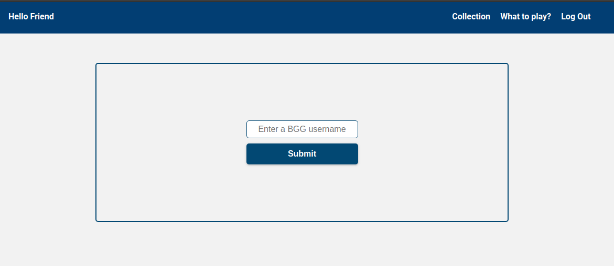
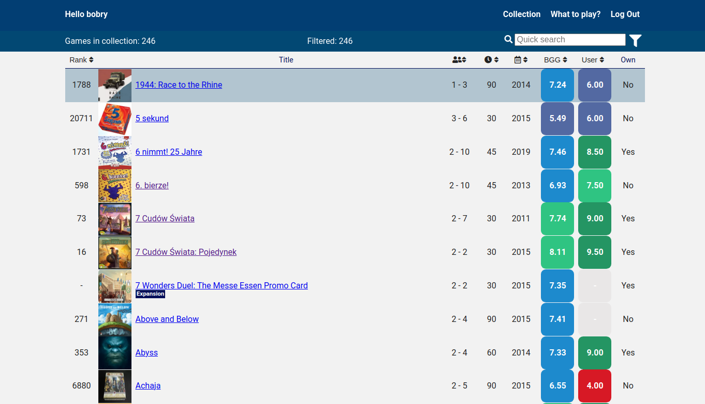
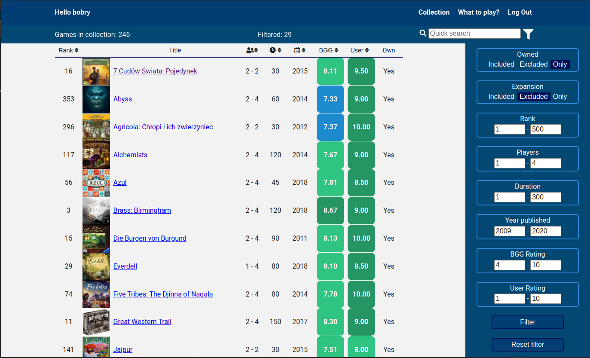
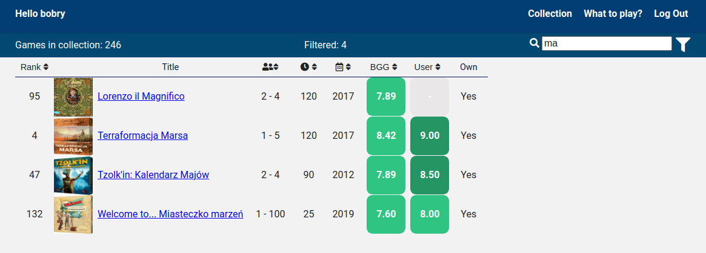
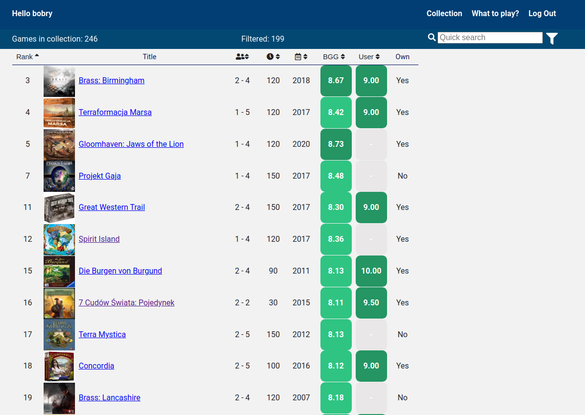

# BGG Library

- Import your board games collection data from https://boardgamegeek.com/.
- Live demo [_here_](https://bgglibrary.netlify.app/) -> user login for tests: "bobry"

## Table of Contents

- [General Info](#general-information)
- [Technologies Used](#technologies-used)
- [Features](#features)
- [Screenshots](#screenshots)
- [Project Status](#project-status)

## General Information

- Website import boardgame collection from boardgamegeek service.
- Collection can be filtered and sorted.
- Searching board game in collection.

## Technologies Used

- React
- React router
- SASS

## Features

List the ready features here:

- import collection from BGG
- filter imported data
- sort imported data
- dynamic search imported data

To do:

- Version for mobile phones
- What to play - algorithm choosing random game from collection depending on number of players
- Popup with more info about game
- Animation for loading data

## Screenshots

## Project Status

Project is: _in progress_
